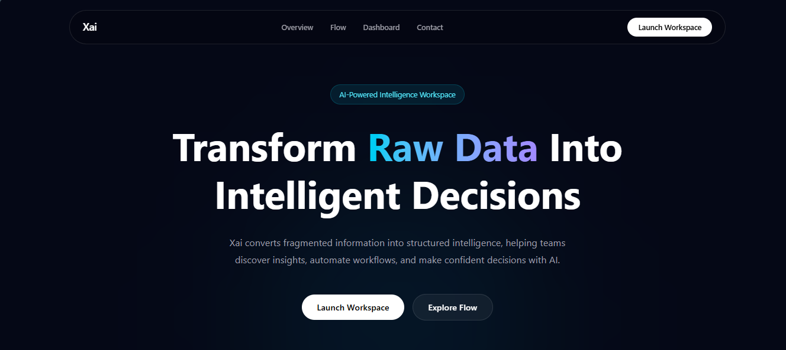
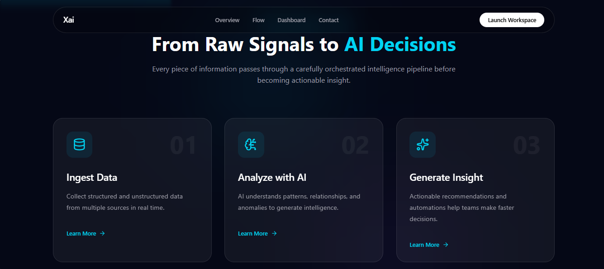
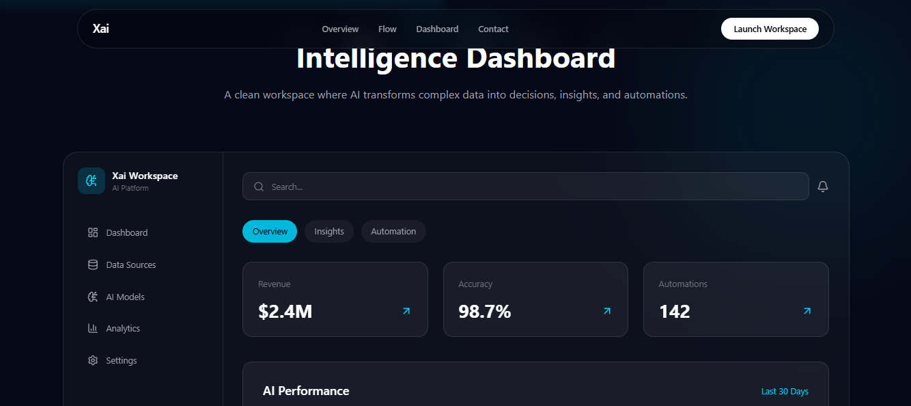
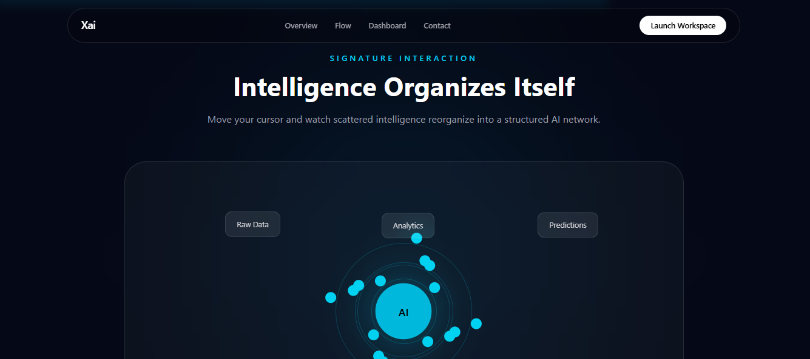
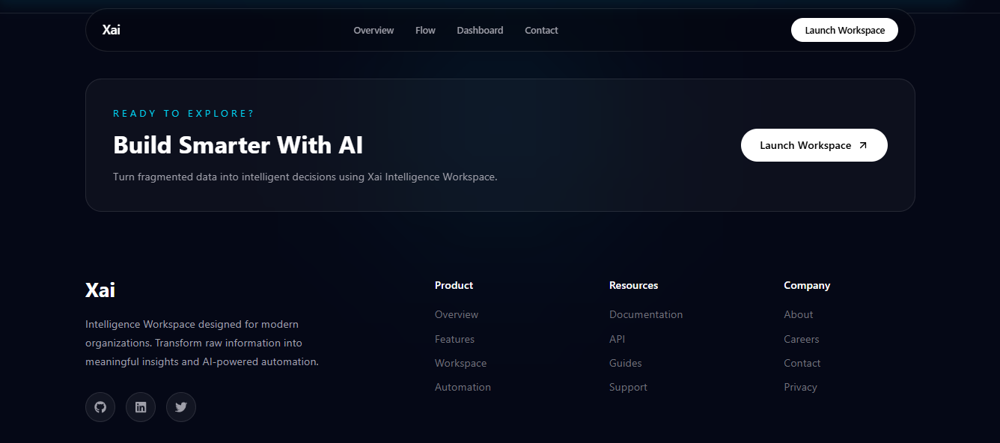

# 🤖 Xai – Intelligence Workspace

A high-fidelity interactive AI product experience built for the **RacoAI Frontend Challenge**. This project demonstrates how raw data is transformed into structured intelligence, actionable insights, and AI-powered automation through modern UI design, immersive animations, and interactive 3D visualization.

---

## 🌐 Live Demo

**Live Website: 👉** https://raco-ai-assignment.vercel.app

---

## 📸 Screenshots

##### Hero Section

<p align="center">
  
</p>

##### Intelligence Flow Section

<p align="center">
  
</p>

##### Dashboard Preview

<p align="center">
  
</p>

##### Signature Interaction Section

<p align="center">
  
</p>

##### Footer Section

<p align="center">
  
</p>

---

## 🎯 Overview

**Xai – Intelligence Workspace** is a modern AI product interface that visually communicates the journey of data through an intelligent system.

The experience follows the narrative:

```
Raw Data
      ↓
Structured Intelligence
      ↓
Actionable Insights
      ↓
AI Automation
```

The project emphasizes product thinking, clean engineering, smooth motion, reusable components, and modern interaction design.

---

## ✨ Features

### Hero Experience

- Interactive AI product introduction
- Responsive 3D visualization
- Animated gradient background
- Modern typography
- Smooth entrance animations

---

### Intelligence Flow

Visual explanation of AI processing:

- Ingest Data
- Analyze with AI
- Generate Insights

Includes:

- Scroll animations
- Hover interactions
- Motion transitions
- Glassmorphism cards

---

### Dashboard Preview

Modern AI workspace including:

- Sidebar navigation
- Analytics dashboard
- KPI cards
- Interactive tabs
- Animated charts
- Responsive layout

---

### Signature Interaction

Interactive section showcasing:

- Motion-based UI
- Cursor interaction
- Floating elements
- Animated intelligence network

---

### UI Enhancements

- Animated Background
- Cursor Glow
- Scroll Progress Indicator
- Smooth section transitions
- Responsive layout
- Premium glassmorphism interface

---

## 🛠️ Tech Stack

- Next.js (App Router)
- React
- Tailwind CSS
- Framer Motion
- GSAP
- Three.js
- React Three Fiber
- Lucide React
- React Icons
